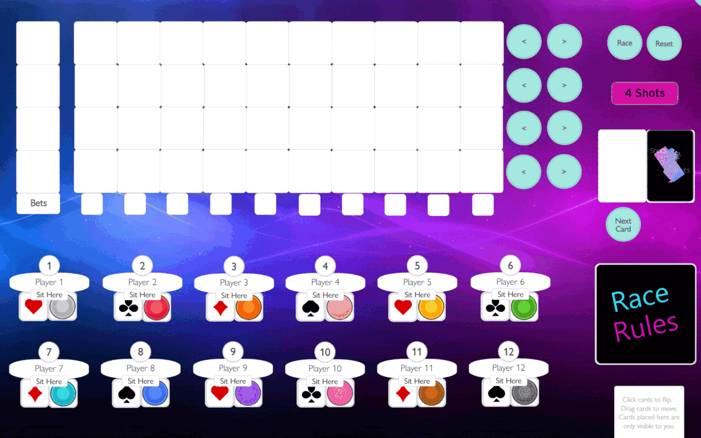
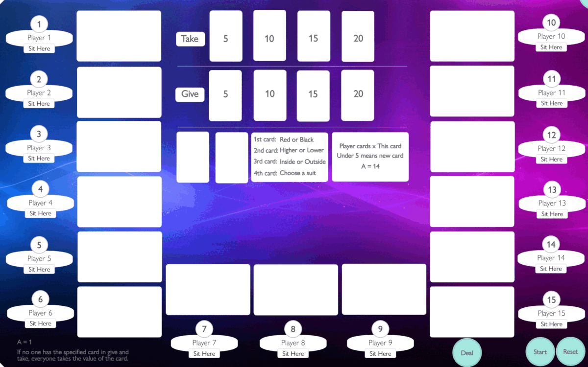
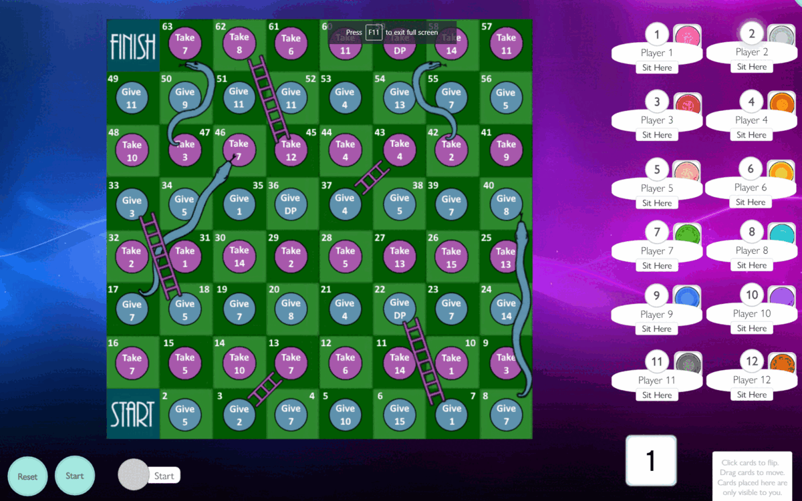

# PlayingCard.io Games

## Todo:
- [Labyrinth](https://virtualtabletop.io/)

## [Bet Yah Shot](https://github.com/Steefyo/PlayingCards.io/raw/main/BetYahShot/bet-yah-shot.pcio)

### Cards:
- ( 44 cards ) 5x
- ( 52 cards ) Bday
- ( 80 cards ) Modnar
- ( 46 cards ) Spliff

### Players:
- 12

### Rules:
- Mode gets picked ( 5x, bday, modnar, spliff, ect )
- Everyone receives pucks
- Place your pucks on the cards
- Cards get revealed ( aka drink )
- ? card means roll

### Demo:

## [Bus](https://github.com/Steefyo/PlayingCards.io/raw/main/Bus/bus.pcio)

### Cards:
- 4 Decks A, 2, 3, 4, 5, 6, 7, 8, 9, 10, J, Q, K
- 13 Jokers ( unplayable cards )

### Players:
- 16

### Rules:
- Use your cards wisely to give out shots
- Try to end up with the least amount of cards
- You can use multiple of the same cards ( example: multiple 4's )
- Based on the row you used your cards on, you give tha amount of shots
- If you end up with the most amount of cards you have to ride the bus
- The dice decides the bus fee ( aka your shots to take )
- The person in the bus has to guess Black or Red on the first card
- The person in the bus has to guess Higher or Lower on the rest of the cards
- If the person on the bus is incorrect the bus resets and the person takes the bus fee shots

### Demo:

## [Camp blood](https://github.com/Steefyo/PlayingCards.io/raw/main/CampBlood/camp-blood.pcio)

### Cards:
- 1 Jason
- 4 Camps
- 8 Face cards ( Q, K )

### Players:
- 8

### Rules:
- Place your card on one of the available cabins
- If Jason in the cabin you lose
- Each round the amount of cabins reduce
- Game goes on till there is one survivor or everyone is dead

### Demo:

## [Liverkiller 1](https://github.com/Steefyo/PlayingCards.io/raw/main/Liverkiller1/liverkiller-part-1.pcio)

### Players:
- 12

### Demo:

## [Race](https://github.com/Steefyo/PlayingCards.io/raw/main/Race/race.pcio)

### Cards:
- 4 A's ( aka players )
- 1 Small deck A, 2, 3, 4, 5, 6, 7, 8, 9, 10, J, Q, K
- 1 Big deck A, 2, 3, 4, 5, 6, 7, 8, 9, 10, J, Q, K

### Players:
- 8

### Rules:
- Player bets a suit ( Clubs, Diamond, Harts, Spades ) to drink with
- Player bets a suit ( Clubs, Diamond, Harts, Spades ) which wins
- Each turn the card moves with the corresponding suit
- The small cards only gets revealed when all the cards have passed it
- The suit of the small card decides which card moves one back
+ At the end of the game:
+ #1 Gives 20 shots
+ #2 Gives 10 shots
+ #3 Does nothing
+ #4 Rolls the dice

### Demo:

## [Shitty](https://github.com/Steefyo/PlayingCards.io/raw/main/Shitty/shitty.pcio)

### Cards:
- 4 decks A, 2, 3, 4, 5, 6, 7, 8, 9, 10, J, Q, K

### Players:
- 15

### Rules:
- Player chooses Red or Black
- Player chooses Higher or Lower
- Player chooses Inside or Outside
- Player chooses a suit

### Demo:

## [Shots and ladders](https://github.com/Steefyo/PlayingCards.io/raw/main/ShotsAndLadders/shots-and-ladders.pcio)

### Players:
- 12

### Demo:

