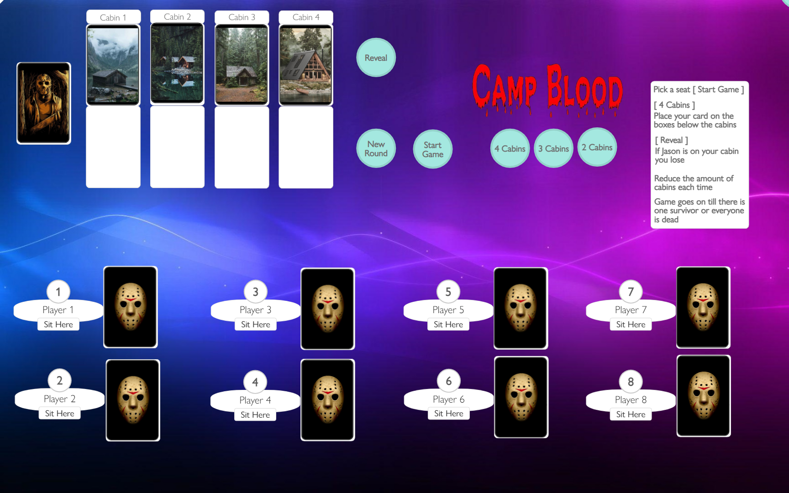

# PlayingCard.io Games (selfmade)

## [Bet Yah Shot](https://github.com/Steefyo/PlayingCards.io/raw/main/BetYahShot/bet-yah-shot.pcio)

### Cards:
- 5x
- Bday
- Modnar
- Spliff

### Players:
- 12

### Rules:
- Mode gets picked ( 5x, bday, modnar, spliff, ect )
- Everyone receives pucks
- Place your pucks on the cards
- Cards get revealed ( aka drink )
- ? card means roll

### Demo:

## [Bus](https://github.com/Steefyo/PlayingCards.io/raw/main/Bus/bus.pcio)

### Cards:
- 4 Decks A, 2, 3, 4, 5, 6, 7, 8, 9, 10, J, Q, K
- 13 Jokers ( unplayable cards )

### Players:
- 16

### Rules:
- Use your cards wisely to give out shots
- Try to end up with the least amount of cards
- You can use multiple of the same cards ( example: multiple 4's )
- Based on the row you used your cards on, you give tha amount of shots
- If you end up with the most amount of cards you have to ride the bus
- The dice decides the bus fee ( aka your shots to take )
- The person in the bus has to guess Black or Red on the first card
- The person in the bus has to guess Higher or Lower on the rest of the cards
- If the person on the bus is incorrect the bus resets and the person takes the bus fee shots

### Demo:

## Camp blood

